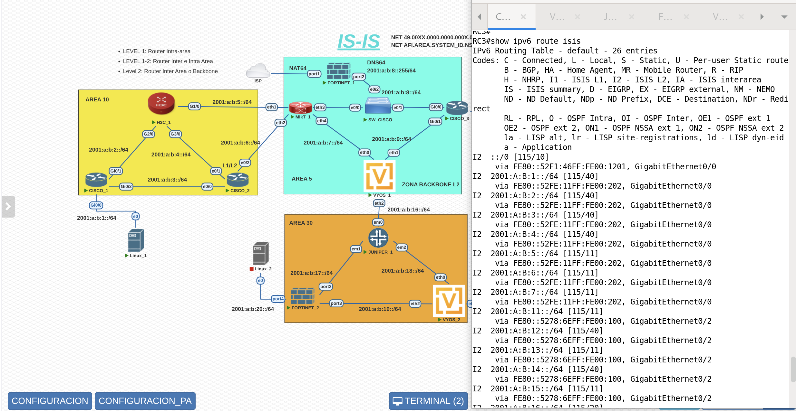
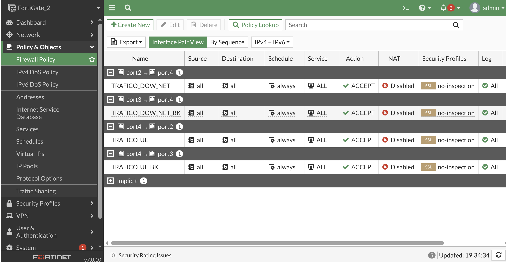

# ISIS_IPv6
## Topología del laboratorio

## Tabla de enrutamiento CISCO_3

## Resolucion DNS64 y Prueba de Conectividad Internet

## Prueba de Conectividad LANs HOSTS

## Politicas de Firewall Fortigate_2

## Politicas de Firewall Fortigate_1 NAT64

